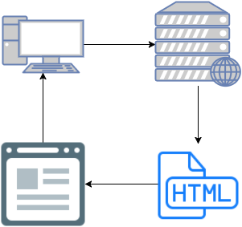
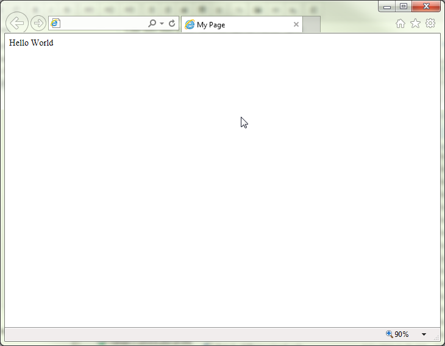

# Basics of HTML

## Basics of a loading a web-page

When you visit a website, there is a lot happening behind the scenes before the page you loaded shows up.

1. Your browser, such as Chrome, Internet Explorer, Firefox, etc, makes a call to a domain (e.g. www.google.com)
2. The server behind that domain finds the page's HTML contents and sends it back to the browser.
3. The browser then displays that HTML.



## What is HTML?

As mentioned above, [HTML](https://en.wikipedia.org/wiki/HTML) is what the browser needs to display a page. It has three major components that **must** be present in order for the web site to display properly:

* A "Doctype" to tell the browser what type of page this is.
* A "head" where all the information about the page goes.
* A "body" where the contents of the page go.

Here is an example of what an html file looks like:
```
<!DOCTYPE html>
<html>
<head>
	<meta charset="utf-8">
	<title>My Page</title>
</head>
<body>
	Hello World
</body>
</html>
```
Which will generate a page like this:


Not all that amazing yet, but that's where Bootstrap will come into play