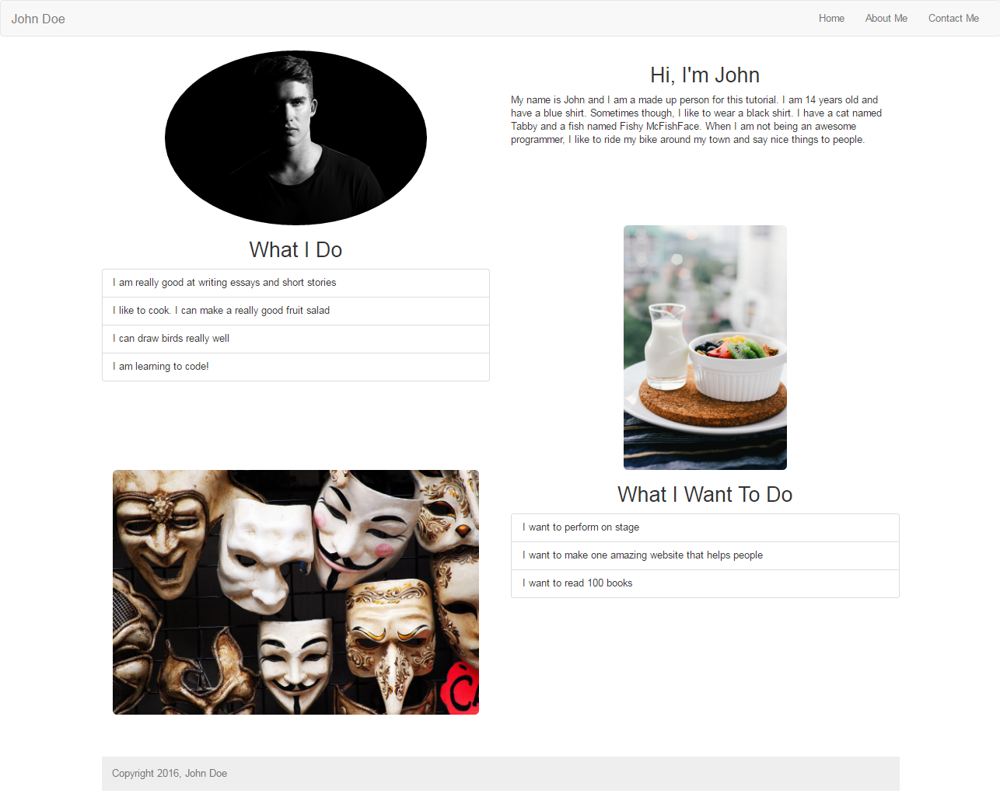

# Building the About Page

1. Make a copy of ```template.html``` and paste it in the ```pages``` directory as ```about.html```
2. Find the line ```<li><a href="index.html">Home</a></li>``` and replace it with 
```
	<li><a href="../index.html">Home</a></li>
```
3. Next, find the line ```<link rel="stylesheet" href="css/portfolio.css">``` and replace it with 
```
	<link rel="stylesheet" href="../css/portfolio.css">
```
4. This is because our about page is in a different folder, we need to tell the browser to look in another folder when trying to load those files
5. Find ```<!-- This is where our page's content will go -->``` and replace it with
```
	<div id="about-page"></div>
```
6. Next we are going to create 3 rows for all of our content inside of the div we just created. 
7. This is done by repeating this code three times:
```
	<div class="row">
		<div class="col-md-6"></div>
		<div class="col-md-6"></div>
	</div>
```

## First Row - Introduction

1. Our first row will be a quick introduction. Here we will have a picture in the left and a little bio on the right.
2. First lets add a picture in the first column
```
	
```
	3. Notice how we are using the ```img-circle``` class to make a circle around the image.
	4. We should also add the ```text-center``` class to the column to align the image properly
5. Next, lets add a little biography about us.
```
	<h2 class="text-center">Hi, I'm John</h2>
	<p id="bio">
		My name is John and I am a made up person for this tutorial. I am 14 years old and have a blue shirt. Sometimes though, I like to wear a black shirt. I have a cat named Tabby and a fish named Fishy McFishFace. When I am not being an awesome programmer, I like to ride my bike around my town and say nice things to people.
	</p>
```
	6. Notice how we gave the paragraph its own id. This is so that in the future we can tinker with it if we like without messing up any other paragraphs in our website.

## Second Row - What I do

1. Our second row will be a list of things we like to do or can do very well. Here we will have a picture on the right and the list of the left
2. Again, lets beging with the picture. Add this to the **second** column of the second row.
```
	
```
	3. This time around we are using the rounded image class.
	4. Dont forget to add ```text-center``` class to the column, to align the image
5. Next, we will add the content for this row.
```
	<h2 class="text-center">What I Do</h2>
	<p id="what-i-do">
		<ul class="list-group">
			<li class="list-group-item">I am really good at writing essays and short stories</li>
			<li class="list-group-item">I like to cook. I can make a really good fruit salad</li>
			<li class="list-group-item">I can draw birds really well</li>
			<li class="list-group-item">I am learning to code!</li>
		</ul>
	</p>
```
	6. Notice how we are using [Bootstrap List Groups](https://getbootstrap.com/components/#list-group) to list everything. This Bootstrap component makes lists a lot more interesting to look at.

## Third Row - What I Want To Do

1. Our third and final row will be what we want to do. Like the first row, we will have the image on the left and the content on the right.
2. Lets add an image to the first column (remember to add the ```text-center``` class to the column)
```
	
```
3. Next we are going to add the content, including another set of List Group
```
	<h2 class="text-center">What I Want To Do</h2>
	<p id="what-i-want-to-do">
		<ul class="list-group">
			<li class="list-group-item">I want to perform on stage</li>
			<li class="list-group-item">I want to make one amazing website that helps people</li>
			<li class="list-group-item">I want to read 100 books</li>
		</ul>
	</p>
```


> #### Success::Our Page So far
>
> 
> ##### Nice! We still have a *little* bit of work to do.