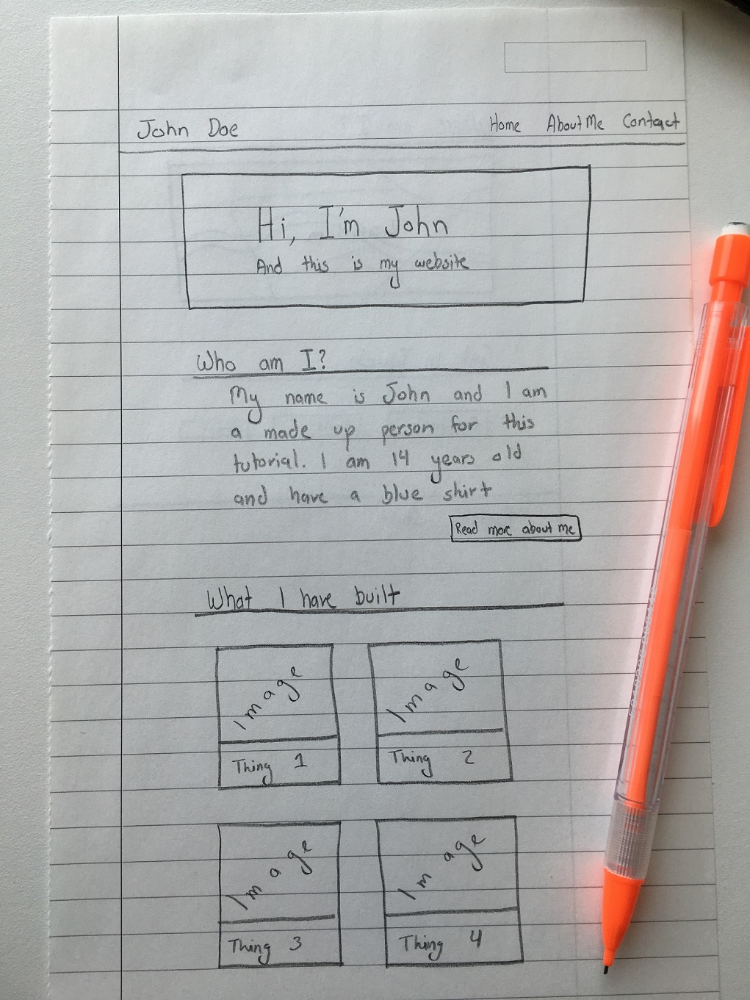
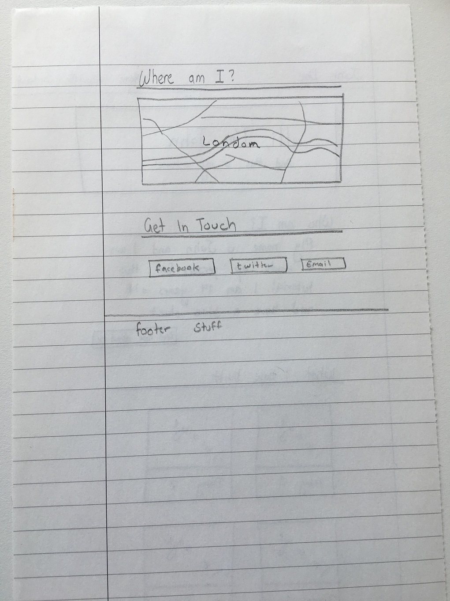

# Designing the Home Page

Now that our template has been built, we can start working on our homepage.

Like before, we should **always** design the page before we start coding.

For the purpose of this tutorial, we will be putting the following bits into our home page:

* Large welcome message
* A *tiny* bit about me (the bulk of this information will go in a separate page later on)
* 4 of the most recent things that I have built
* A map of where I am
* My social media contact links

Personally, I like to visualize the end result by drawing it on a piece of paper; it does not have be exact, but at least give you an understanding of what it is that you are building. Here is what I imagine the home page will look like on this website (apologies for the handwriting :P ):

