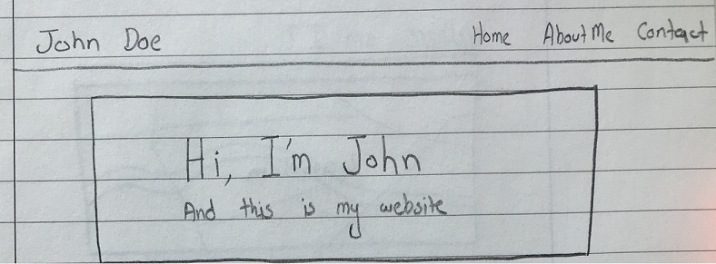
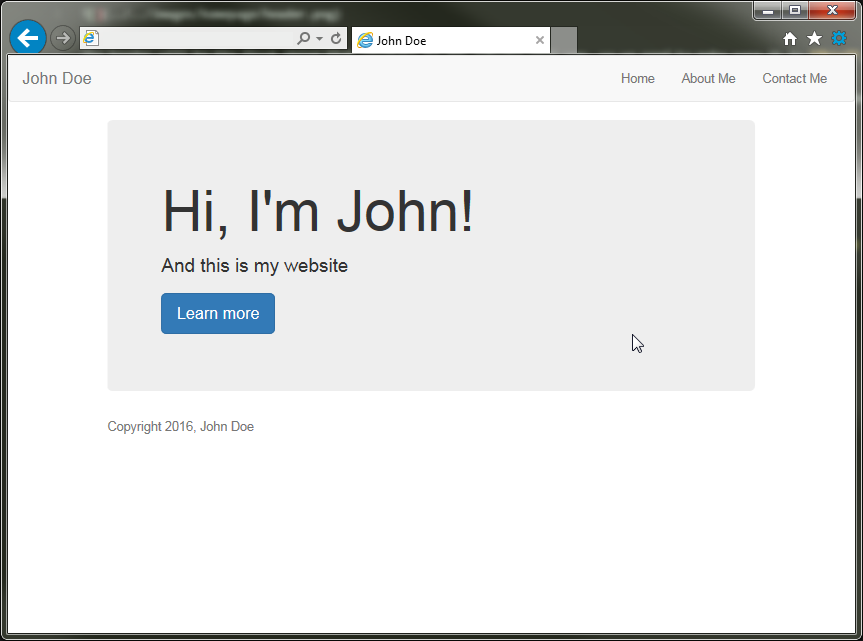

# Building the Welcome Header



The header will be the first thing that visitors to our website will see, so we need to make sure it is **big**, **attractive** and **to the point**!

Thankfully Bootstrap provides us will a pre-built header that we can use. In Bootstrap, the component we will be using is called a [**"Jumbotron"**](https://getbootstrap.com/components/#jumbotron)

# Before Starting

We need to copy everything from the template to the main file (```index.html```):

1. Copy ```template.html``` to ```index.html```
2. Inside the index file, replace ```<!-- This is where our page's content will go -->``` with ```<!-- HOMEPAGE -->```

# Coding the Header

1. Inside the index file, type this in *after* the ```<!-- HOMEPAGE -->``` comment
   2. ```
	<!-- HEADER -->
	<div class="jumbotron">
		<h1>Hi, I'm John!</h1>
		<p>And this is my website</p>
		<p><a class="btn btn-primary btn-lg" href="#" role="button">Learn more</a></p>
	</div>
```


> #### Success::Our Website So far
>
> 
> ##### Starting to look nice :D 