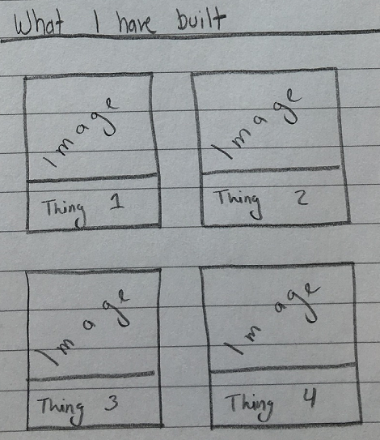

# Building the "What I have built" Section



The next section that we are going to add to our website will showcase a list of things that we have recently built. For you, this can be really anything you are proud of; so it could be a cool project or a nice thing you created or helped create. 

For this tutorial, we will be outlining four things, with an image and a short description for each. We will also include a link for each item so that our website's users can learn more about it.

## Coding the section

1. In the ```index.html``` file, we will create a new section after the "Who Am I" section we created earlier.
   2. ```
	<!-- WHAT I HAVE BUILT SECTION -->
	<section id="what-i-have-built">
		<h2>What I have built</h2>
		<hr>
	</section>
```
3. In order to organize our items, we will add a new div tag with a class of "row" ```<div class="row"></div>``` after the ```<hr>``` tag.
4. Next we will create two div tags inside of the row with the class of ```col-md-6```. With that class, our div will only take up 6 columns in the row for all devices with a medium screen size (laptops, desktops, some large tablets) and will take up all of the columns in smaller screen sizes.
5. So far, our section's code will look like this
   6. ```
	<section id="what-i-have-built">
		<h2>What I have built</h2>
		<hr>
		<div class="row">
			<div class="col-md-6"></div>
			<div class="col-md-6"></div>
		</div>
	</section>
```
7. Next let's work on our first item. For this we will using a [Bootstrap Panel](https://getbootstrap.com/components/#panels)
8. Inside of our first column, lets add the following bit of code:
	9. ```
	<div class="panel panel-default">
		<div class="panel-heading"></div>
		<div class="panel-body"></div>
		<div class="panel-footer"></div>
	</div>
```
	10. This will create an empty gray panel.
11. Add the following in the panel:
	12. **Heading** : Arctic Cupcakes Website
	13. **Body**: Image to ```https://images.unsplash.com/photo-1455731657401-43502b7c1ab9?ixlib=rb-0.3.5&q=80&fm=jpg&crop=entropy&s=42b2363736f20d8f71e79dc501b96b03```. And a quick little description.
	14. **Footer**: Link to ```https://en.wikipedia.org/wiki/Cupcake```
	15. ```
	<div class="panel panel-default">
		<div class="panel-heading">
			<h3 class="panel-title">Arctic Cupcakes Website</h3>
		</div>
		<div class="panel-body">
			
			<br>
			<p>This is a made up website for a made up company. I built it using the amazing Python language and the Bootstrap framework.</p>
		</div>
		<div class="panel-footer">
			<a href="https://en.wikipedia.org/wiki/Cupcake" class="btn btn-primary btn-block">See it in action</a>
		</div>
	</div>
```
16. Next we are going to add another panel in the second column div we created earlier.
	17. **Heading** : Super Awesome Sandcastle
	18. **Body**: Image to ```https://images.unsplash.com/photo-1461598198498-686a2c168484?ixlib=rb-0.3.5&q=80&fm=jpg&crop=entropy&s=360625b50d0d104d8324590ec660206c```. And a quick little description: ``` I built this cool castle in the French Riviera which won a local competition.```
	19. **Footer**: Link to ```https://en.wikipedia.org/wiki/French_Riviera```
	20. ```
	<div class="panel panel-default">
		<div class="panel-heading">
			<h3 class="panel-title">Super Awesome Sandcastle</h3>
		</div>
		<div class="panel-body">
			
			<br>
			<p>I built this cool castle in the French Riviera which won a local competition.</p>
		</div>
		<div class="panel-footer">
			<a href="https://en.wikipedia.org/wiki/French_Riviera" class="btn btn-primary btn-block">Learn more about it</a>
		</div>
	</div>
```
21. 