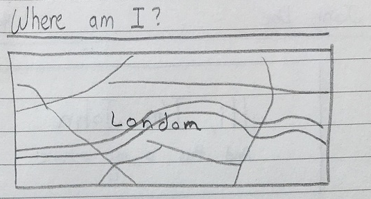
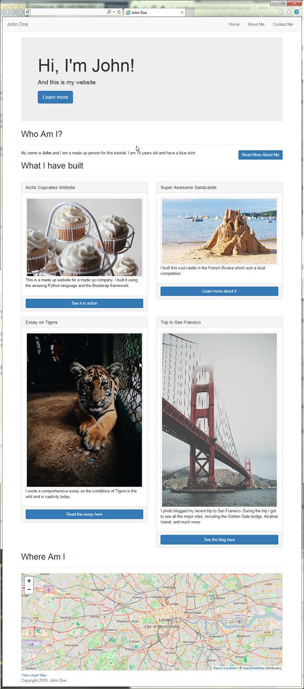

# Building the "Where Am I" Section



The next section that we will be building is the "Where Am I" section. This will tell the visitors of our website where we are located, in case they are curious.

## Coding the Section

1. In the ```index.html``` file, we will create a new section after the "What I have built" section we created earlier.
	2. ```
	<!-- WHERE AM I SECTION -->
	<section id="where-am-i">
		<h2>Where Am I</h2>
		<hr>
		<div id="map"></map>
	</section>
```

## Getting the Map

Next we will get the map to put in the ```map``` div.

1. Go to [OpenStreetMap](https://www.openstreetmap.org)
2. Navigate to where it is you want to show on your website
	3. **Never show your exact home address or any valuable personal information**. Instead, show the city or neighborhood you live in.
4. On the right, click on **Share**
5. Select the **HTML** tab and copy the HTML code
6. Paste the HTML code into your ```index.html``` inside the ```map``` div


## Customizing the Map

1. In the code you pasted, we need to modify it a bit to make it conform with our website.
2. Change the width from ```425``` to ```100%```
3. Change the border color from ```black``` to ```#eeeeee```
4. Your final section code should look something like this:
	5. ```
	<!-- WHERE AM I SECTION -->
	<section id="where-am-i">
		<h2>Where Am I</h2>
		<hr>
		<div id="map">
			<iframe width="100%" height="350" frameborder="0" scrolling="no" marginheight="0" marginwidth="0" src="http://www.openstreetmap.org/export/embed.html?bbox=-0.23380279541015625%2C51.458820284989834%2C-0.09235382080078125%2C51.549003795693565&amp;layer=mapnik" style="border: 1px solid #eeeeee"></iframe><br/><small><a href="http://www.openstreetmap.org/#map=13/51.5039/-0.1631">View Larger Map</a></small>
		</div>
	</section>
```

> #### Success::Our Website So far
>
> 
> ##### That was pretty easy, no?