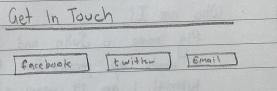
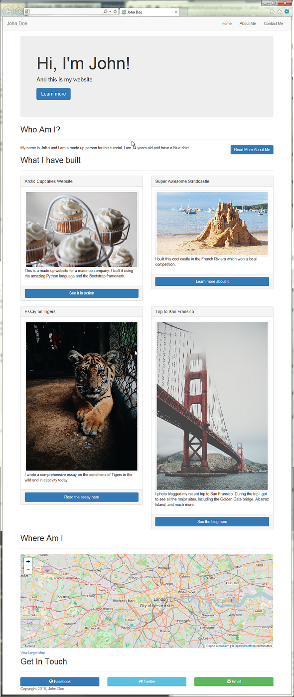

# Building the "Get In Touch" Section



The final section of the homepage will be a "Get In Touch" section, which will guide people to our social media or email. For this tutorial, this section will contain three buttons, all in a single row.

## Coding the section

1. In the ```index.html``` file, we will create a new section after the "Where Am I" section we created earlier.
	2. ```
	<!-- GET IN TOUCH SECTION -->
	<section id="get-in-touch">
		<h2>Get In Touch</h2>
		<hr>
		<div class="row"></div>
	</section>
```
3. You will notice that we created a ```row``` class. This is where all three of our buttons will go.
4. Next we will create three divs with a class of ```col-md-4```. This will create the three columns for our buttons
5. In the first column, we will create a button that will link to our facebook page
	6. ```<a href="https://www.facebook.com/acorn.aspirations" class="btn btn-block btn-primary">Facebook</a>```
	7. You will notice that this link is a button, that takes up the whole block (column) and is a primary button (You can learn about the different button types and colors [here](https://getbootstrap.com/css/#buttons))
	8. Next lets add an *icon* to the button. Bootstrap comes with over 250 icons that we can use! You can see them all [here](https://getbootstrap.com/components/#glyphicons).
	9. Replace ```Facebook``` with ```<span class="glyphicon glyphicon-globe"></span> Facebook```
10. In the next column, lets create a link to Twitter
	11. ``` <a href="https://twitter.com/acornaspiration" class="btn btn-block btn-info"><span class="glyphicon glyphicon-bullhorn"></span> Twitter</a> ```
12. In the final column, lets create a link to our email address
	13. ``` <a href="mailto:user@domain.com" class="btn btn-block btn-success"><span class="glyphicon glyphicon-envelope"></span> Email</a> ```
14. Your final section code should look something like this:
	15. ```
	<!-- GET IN TOUCH SECTION -->
	<section id="get-in-touch">
		<h2>Get In Touch</h2>
		<hr>
		<div class="row">
			<div class="col-md-4">
				<a href="https://www.facebook.com/acorn.aspirations" class="btn btn-block btn-primary"><span class="glyphicon glyphicon-globe"></span> Facebook</a>
			</div>
			<div class="col-md-4">
				<a href="https://twitter.com/acornaspiration" class="btn btn-block btn-info"><span class="glyphicon glyphicon-bullhorn"></span> Twitter</a>
			</div>
			<div class="col-md-4">
				<a href="mailto:user@domain.com" class="btn btn-block btn-success"><span class="glyphicon glyphicon-envelope"></span> Email</a>
			</div>
		</div>
	</section>
```

> #### Success::Our Website So far
>
> 
> ##### Wow Wow Wow :D